# Magic Weapons

## Arcane

||| English Name | Chinese Name |
|---|---|---|---|
|  | 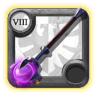 | Arcane Staff | 祕術法杖（單手奧） |
|  | 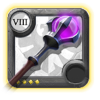 | Great Arcane Staff | 祕術長杖（時停） |
|  | 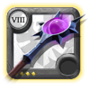 | Enigmatic Staff | 謎團法杖（盾杖） |
|  | 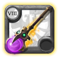 | Witchwork Staff | 巫術法杖（黑洞） |
|  | 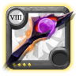 | Occult Staff | 奧祕法杖（走路杖） |
|  | 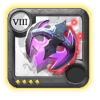 | Malevolent Locus | 惡毒軌跡（Locus） |
|  | 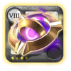 | Evensong | 夜禱之戒 |
|  | 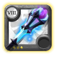 | Astral Staff | 星界法杖 |

## Cursed

||| English Name | Chinese Name |
|---|---|---|---|
|  | 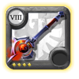 | Cursed Staff | 詛咒法杖（單手咒） |
|  | 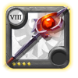 | Great Cursed Staff | 詛咒長杖 |
|  | 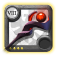 | Demonic Staff | 惡魔法杖 |
|  | 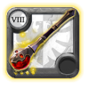 | Lifecurse Staff | 命咒法杖 |
|  | 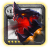 | Cursed Skull | 詛咒頭骨（骷顱頭） |
|  | 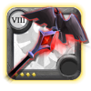 | Damnation Staff | 天譴法杖 |
|  | 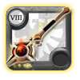 | Shadowcaller | 喚影者 |

## Fire

||| English Name | Chinese Name |
|---|---|---|---|
|  | 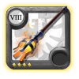 | Fire Staff | 火焰法杖（單手火） |
|  | 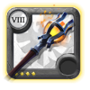 | Great Fire Staff | 火焰長杖 |
|  | 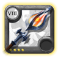 | Infernal Staff | 煉獄法杖（傳染火） |
|  | 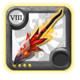 | Wildfire Staff | 野火法杖（火球） |
|  | 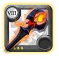 | Brimstone Staff | 炎火石法杖（隕石） |
|  | 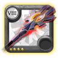 | Blazing Staff | 灼燒法杖（火龍捲） |
|  | 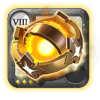 | Dawnsong | 暮歌之戒（火鳥） |

## Frost

||| English Name | Chinese Name |
|---|---|---|---|
|  | 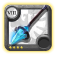 | Frost Staff | 寒冰法杖（單手冰） |
|  | 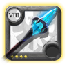 | Great Frost Staff | 寒冰長杖 |
|  | 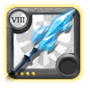 | Glacial Staff | 冰河法杖 |
|  | 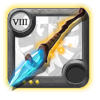 | Hoarfrost Staff | 白霜法杖（雪球） |
|  | 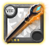 | Icicle Staff | 冰柱法杖 |
|  | 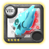 | Permafrost Prism | 永凍稜鏡（冰菠蘿） |
|  | 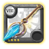 | Chillhowl | 冰嘯法杖 |

## Holy

||| English Name | Chinese Name |
|---|---|---|---|
|  | 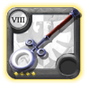 | Holy Staff | 神聖法杖（單手奶） |
|  | 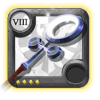 | Great Holy Staff | 神聖長杖 |
|  | 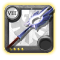 | Divine Staff | 神性法杖 |
|  | 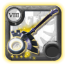 | Lifetouch Staff | 生命之觸法杖 |
|  | 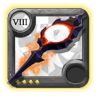 | Fallen Staff | 墮落法杖 |
|  | 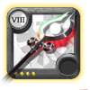 | Redemption Staff | 贖罪法杖（彈彈奶） |
|  | 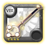 | Hallowfall | 墮神法杖 |

## Nature

||| English Name | Chinese Name |
|---|---|---|---|
|  | 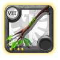 | Nature Staff | 自然法杖（小樹枝） |
|  | 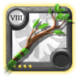 | Great Nature Staff | 自然長杖 |
|  | 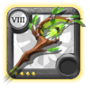 | Wild Staff | 狂野法杖 |
|  | 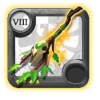 | Druidic Staff | 德魯伊法杖 |
|  | 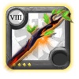 | Blight Staff | 瘟疫法杖 |
|  | 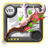 | Rampant Staff | 災禍法杖（鹿杖） |
|  | 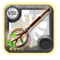 | Ironroot Staff | 鐵根法杖 |

## Shapeshifter

||| English Name | Chinese Name |
|---|---|---|---|
|  | 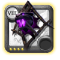 | Prowling Staff | 潛行者法杖（豹） |
|  |  | Rootbound Staff | 林語者法杖（樹人） |
|  | 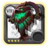 | Primal Staff | 原始野性法杖（熊） |
|  | 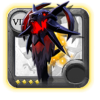 | Bloodmoon Staff | 血月法杖（狼人） |
|  | 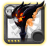 | Hellspawn Staff | 煉獄裂隙法杖（惡魔） |
|  | 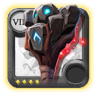 | Earthrune Staff | 大地符文法杖（石人） |
|  | 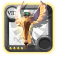 | Lightcaller | 光之召喚者（光雞） |
